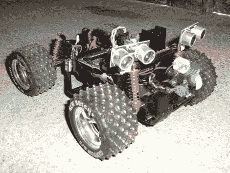

# Arduino Rover 在避障方面加倍努力

> 原文：<https://hackaday.com/2012/06/06/arduino-rover-doubles-up-on-obstacle-avoidance/>

[爱德华·罗斯]在《炫耀》[中写道，他第一次尝试建造一辆自主漫游车](http://www.entremaqueros.com/bitacoras/roshardware/archives/vehiculo-autonomo-con-arduino/) ( [译](http://translate.google.com/translate?sl=auto&tl=en&js=n&prev=_t&hl=en&ie=UTF-8&layout=2&eotf=1&u=http%3A%2F%2Fwww.entremaqueros.com%2Fbitacoras%2Froshardware%2Farchives%2Fvehiculo-autonomo-con-arduino%2F))。和许多这些项目一样，他从遥控玩具卡车的底座开始。这解决了许多机械问题，如转向、运动和动力源。

他只是需要一种控制车辆的方法。最近的 LayerOne 徽章攻击是通过无线控制器协议或直接在车辆上添加 Arduino 来实现的。【Eduard】选择了后者，在这个过程中还包括了避障传感器。我们见过不少使用这些超声波测距仪的。他决定走一条不同的路线，增加两个，而不是通过在伺服电机上安装一个来扫描。

休息后的视频显示车辆成功地通过了一个狭窄的空间。这让我们想知道静止传感器能处理多少数据？我们不清楚这些设备的水平灵敏度有多高。如果你有一些见解，请在评论区分享你的知识。

[https://www.youtube.com/embed/-M0vKeAMzd4?version=3&rel=1&showsearch=0&showinfo=1&iv_load_policy=1&fs=1&hl=en-US&autohide=2&wmode=transparent](https://www.youtube.com/embed/-M0vKeAMzd4?version=3&rel=1&showsearch=0&showinfo=1&iv_load_policy=1&fs=1&hl=en-US&autohide=2&wmode=transparent)