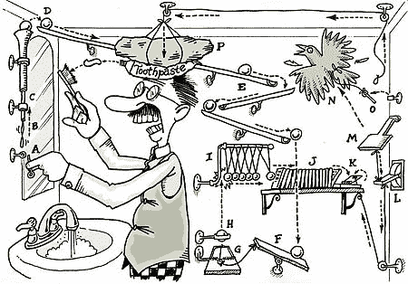

# Arduino +伺服+透明胶带==有趣的对话

> 原文：<https://hackaday.com/2015/01/24/arduino-servo-scotch-tape-an-interesting-conversation/>

如果一个人可以暂时去除他们的幽默感，严肃地看着一台鲁布·戈德堡机器，他们就不会对自己说“这看起来很简单。”事实上，几乎总是有人会问自己“为什么这么简单的任务如此复杂？”

在黑客攻击中，我们经常犯把事情变得比实际需要的更复杂的错误。也许是因为我们可以看到通往同一个目的地的许多不同的路径。也许是因为我们想探索一条特定的道路，即使我们知道这条路可能有点难走。也许只是因为我们可以。

但是想象一下，把一次黑客攻击仅仅作为达到目的的一种手段。想象一下，如果你脑子里没有所有的知识。所有这些工具都由你支配。这会如何改变你的方法？当[yavin427]决定在他最喜欢的视频游戏中自动升级时，很可能他从未拆开过游戏控制器。从未接触过示波器。事实上，他甚至可能不知道什么是晶体管或微控制器。虽然我们的许多读者会选择更困难的方法，直接接入控制器的 TTL 以实现最大效率；最有可能的是，[yavin427]不知道如何做到这一点，因此也就看不到对我们来说显而易见的通往他最终目标的许多其他途径。然而他实现了他的最终目标。他比我们许多人做得更容易，也更简单。

想法？

[https://www.youtube.com/embed/s8v87S8AroE?version=3&rel=1&showsearch=0&showinfo=1&iv_load_policy=1&fs=1&hl=en-US&autohide=2&wmode=transparent](https://www.youtube.com/embed/s8v87S8AroE?version=3&rel=1&showsearch=0&showinfo=1&iv_load_policy=1&fs=1&hl=en-US&autohide=2&wmode=transparent)

感谢[euqinimod]的提示！让他们继续前进！