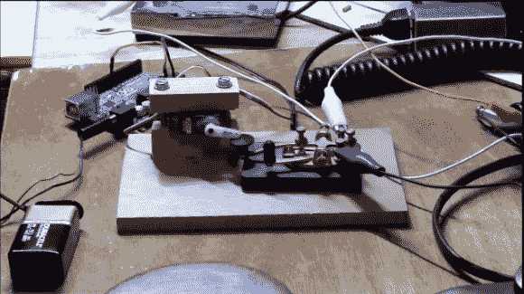

# Arduino 使用直键进行莫尔斯电码辅助

> 原文：<https://hackaday.com/2013/01/03/arduino-using-a-straight-key-for-morse-code-assistance/>

对于那些不熟悉业余无线电的人来说，现在有很多新奇的工具可以让无线电操作员更容易操作。但是发烧友们还是喜欢返璞归真，其中一个方法就是参加直调之夜。这是当你拿出你的传统莫尔斯电码键盘，并与世界各地的其他人聊天。最近一次是在新年前夕。唯一的阻力是，有时需要一段时间才能找到另一个正在听的火腿，这可能意味着长时间重复键入字母 QC SKN(QC 邀请听众回应，SKN 通知他们你正在参加直键之夜)。当然，一个可编程的键控器会为你做到这一点，但这违背了活动的精神。[Mike Herr]通过机械连接 Arduino 和直键发现了一个灰色区域。

你可以在上面的图片中看到一个爱好伺服按下了直键。伺服系统由 Arduino 驱动，它会自动传送一系列字母。正如您在休息后的视频中看到的，一旦[Mike]收到另一名操作员的回复，他就会在接下来的对话中切换到一个巨大的木制直键。

[https://www.youtube.com/embed/Rn7Ky9Ib7ug?version=3&rel=1&showsearch=0&showinfo=1&iv_load_policy=1&fs=1&hl=en-US&autohide=2&wmode=transparent](https://www.youtube.com/embed/Rn7Ky9Ib7ug?version=3&rel=1&showsearch=0&showinfo=1&iv_load_policy=1&fs=1&hl=en-US&autohide=2&wmode=transparent)

[谢谢威廉]