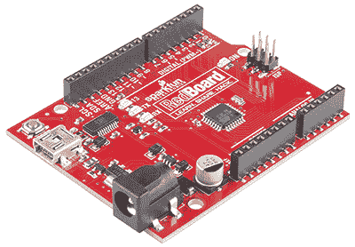

# Arduino Vs. Arduino:经销商的难题

> 原文：<https://hackaday.com/2015/04/15/arduino-vs-arduino-the-resellers-conundrum/>

在过去的几个月里，Arduino 的不同创始人之间的内部斗争达到了顶点。这始于去年 11 月，当时 Arduino SRL(意大利版的有限责任公司)在马萨诸塞州地方法院起诉 Arduino 有限责任公司商标侵权。为了安抚制造商社区的心和思想，Arduino SRL [说他们是真正的 Arduino](http://hackaday.com/2015/03/28/arduino-srl-to-distributors-were-the-real-arduino/) ，因为他们是第一个制造 Arduino 电路板的人。[Arduino SRL 的 Arduino IDE](http://hackaday.com/2015/04/06/arduino-ide-forked/) 的一个分支——仅仅是版本号的更新——是进一步巩固他们作为 Arduino 真正开发者的地位的一个策略。

这是一场混乱，但不仅仅是两个组织为一个商标而战。如果你在网上商店销售 Arduino，你会支持哪一种 Arduino？

Sparkfun 的[Nate]用一个不回答的问题来回答这个问题。

目前，Arduino SRL 是 Arduino Unos 的唯一来源。Sparkfun 将继续从 SRL 购买 Unos，但他们不一定会支持 SRL；人们需要蓝色的 Arduinos，上面有意大利的丝网印刷，Sparkfun 非常乐意提供这些。

然而，关于 Arduino 硬件的未来还有一些问题。Arduino 软件堆栈肯定会在一年内出现，但任何在明年购买数千块小蓝板的人都会感到紧张，这是可以理解的。

这不是 Sparkfun 第一次在 Arduino 供应方面面临挑战。2012 年，当 Arduino Uno R3 发布时，他们非常受欢迎的[发明家套件](https://www.sparkfun.com/products/12060)的所有文档一夜之间就过时了。为了应对这些供应链问题， [Sparkfun 创建了 RedBoard](https://www.sparkfun.com/products/12757) 。

Sparkfun 一直向 Arduino LLC 支付 RedBoard 的版税，就像他们对 Arduino Pro T1 和 T2 Pro Mini T3 所做的一样。实际上，Sparkfun 还在观望，LLC 已经提出生产 Arduino Zero、Uno、Mega 和 Due。

这其中的原因是消费者。如果有人想要 Arduino SRL 制造的主板，他们就会购买。但是，如果客户想要支持 Arduino LLC，也可以考虑这个选项。

这并不是一个很好的位置，但它确实表明了有人可以支持一个 Arduino 而不是另一个。在一两年内，只会有一个 Arduino，但在那之前，如果你有偏好，至少 Sparkfun 在给你选择。

伟大的间谍大战间谍形象归功于 Sparkfun。你为什么不卖眼睛？