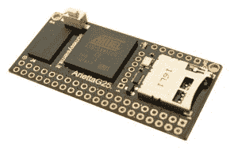

# Arietta G25 让我们想知道 ARM 板的发展方向

> 原文：<https://hackaday.com/2014/11/01/arietta-g25-has-us-wondering-where-arm-boards-are-going/>

这个整洁的小扶手板是 Arietta G25 。它基于 AT91SAM9G25，这是一款运行频率为 400MHz 的 ARM9 芯片。与左边的 DDR2 RAM(128 或 256 兆选项)配对，该板运行 Linux 并运行良好。休息之后，你可以看到[强制性运行的厄运](http://www.acmesystems.it/arietta_adafruit_lcd28)。但在这种情况下，它不只是运行一个演示，而是可以通过试验板上的瞬时按钮进行播放(感谢 Arietta 团队在该设置中使用了绕线)。

看到处理器和 SD 卡插槽之间的垂直焊盘行了吗？这是一个设计用于接受 WiFi 模块的分线接头。在€20-30 根据您的 RAM 选择和只是€7 的 WiFi 模块，这个板肯定是任何嵌入式 Linux 项目的竞争者。但这确实让我们想知道，是应该将这些视为 ARM 板，还是忘记底层开发，只将它们视为具有大量 GPIO 可用的 Linux 机器？

20×2 引脚接头突破了 SAM9 的许多特性。我们非常喜欢为这款设备发布的[互动引脚排列。例如，有三组 USB 主机线可用。但是您需要点击每一个来查看一组用于 SD 卡，另一组用于 WiFi 模块。为 Arietta G25 发布的文档是它最强的一点。干得好！](http://www.acmesystems.it/pinout_arietta)

[https://www.youtube.com/embed/lluFY78mW4U?version=3&rel=1&showsearch=0&showinfo=1&iv_load_policy=1&fs=1&hl=en-US&autohide=2&wmode=transparent](https://www.youtube.com/embed/lluFY78mW4U?version=3&rel=1&showsearch=0&showinfo=1&iv_load_policy=1&fs=1&hl=en-US&autohide=2&wmode=transparent)

[谢谢米歇尔]