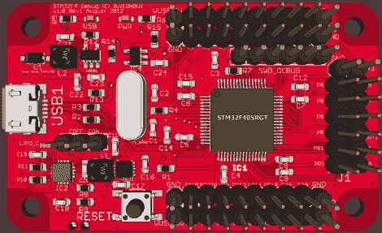

# 基于 ARM 的调试工具旨在提高总线盗版的性能

> 原文：<https://hackaday.com/2012/08/29/arm-based-debugging-tool-aims-to-improve-on-the-bus-pirate-performance/>

总线盗版是一个奇妙的开发工具。它在很多不同的方面都做得很出色。随着它的成熟，社区的支持将它推向了最初设计之外的新领域。这是它的硬件稍微阻碍性能的地方。例如，作为 I2C 或 SPI 嗅探器，它的捕获速度有限。这就是这个委员会可以改进的地方。这是一个基于 STM32 F4 微控制器的调试工具。这是一个 ARM Cortex-M4 芯片，运行频率为 168 MHz，具有 192 KB 的 SRAM。

[TitanMKD]一直致力于设计，但它仍然只是在数字形式。由于没有原型，也没有设备的固件。这是一座需要攀登的高山，也是我们现在推出这个项目的原因之一。[泰坦]的计划是在总线盗版接口之后对此进行建模。我们认为这是一个好主意，因为许多人已经学会了语法。我们在他的网站上没有看到联系方式，但是如果你对这个项目感兴趣，你可以在这里或者他的项目页面上留下你的评论。