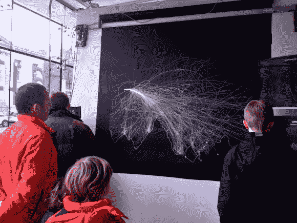

# 艺术装置描绘了月球着陆器的每一个游戏

> 原文：<https://hackaday.com/2012/11/23/art-installation-plots-every-game-of-lunar-lander-that-is-played/>

这个艺术装置让 20 世纪 70 年代的电子游戏再次流行起来。可以在都柏林科学画廊的游戏展上找到。博物馆参观者走向投币式游戏柜，旁观者将看到他们是如何做的，因为着陆被绘制在这块板上。

硬件细节有点难以获得，但我们听说很快会有更多关于我的消息。目前，Flickr 网站是最好的信息来源。通过阅读标题，我们知道一套三个 Mac minis 运行一切。也有一些特写镜头和一个驱动器硬件的视频概述，你可以看到安装在上图的左上角。我们可以告诉你，这是一个字符串绘图仪类似于[建立我们已经看到在过去](http://hackaday.com/2011/04/13/knex-whiteboard-plotter/)。来自[月球着陆器游戏](http://en.wikipedia.org/wiki/Lunar_Lander_(video_game))的遥测数据被转换成指令并直接传送到那个设备。休息后，在剪辑中观看它的运行。

[https://player.vimeo.com/video/54043239](https://player.vimeo.com/video/54043239)

[谢谢桑迪]