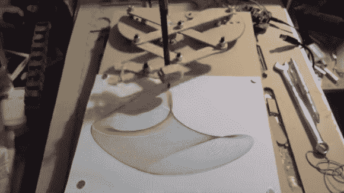
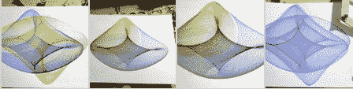

# Art-O-Matic 是 Spirograph 年轻的 Hip 后代

> 原文：<https://hackaday.com/2014/05/30/art-o-matic-is-spirographs-young-hip-offspring/>

我们一些更资深的*读者可能还记得一个叫做[肺活量描记器](http://en.wikipedia.org/wiki/Spirograph)的玩具。万一你没有，这是一个几何形状绘图玩具。它的工作方式是一个塑料圆盘，圆周上有齿轮齿，表面上有各种孔，围绕一个内部有齿轮齿的塑料环旋转。将一支铅笔插入圆盘的一个孔中，当铅笔在圆环内旋转时，可以画出不同的复杂形状，称为次摆线。*

 *

这很有趣，足以让一个孩子开心几分钟。完成一个完整的形状需要一段时间，有时很容易搞砸(特别是如果为铅笔选择的孔靠近圆盘的外部)。[Darcy]认为将 Spirograph 的绘画风格与现代技术结合起来会很棒。结果被称为自动艺术(Art-O-Matic),它自动绘制了一些非常狂野的艺术，你猜对了。

点击休息时间获取更多信息！

[Darcy]通过在 Sketchup 中绘制所有的齿轮和连杆开始了这个项目。一台 CNC 路由器被用来切割零件，之后仅仅几个螺栓和螺母就把机械装置组装起来。在下面的视频中，有两个齿轮盘移动连杆臂。两臂独立运动，一个快一个慢。每个光盘由其自己的步进电机控制。每个步进电机的速度由 Arduino 控制。根据两个电机的速度绘制不同的图案。沿途切换笔色，更添酷炫。

[https://www.youtube.com/embed/uqj7NXhZlxY?version=3&rel=1&showsearch=0&showinfo=1&iv_load_policy=1&fs=1&hl=en-US&autohide=2&wmode=transparent](https://www.youtube.com/embed/uqj7NXhZlxY?version=3&rel=1&showsearch=0&showinfo=1&iv_load_policy=1&fs=1&hl=en-US&autohide=2&wmode=transparent)*