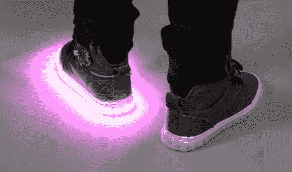

# 随着千禧一代的成长，他们需要更酷的 LED 运动鞋吗？

> 原文：<https://hackaday.com/2013/08/29/as-millenials-grow-up-do-they-demand-cooler-led-sneakers/>

我们希望，无论是谁想出了将 led 集成到童鞋中的想法，他都在某个海滩上休息，享受这个想法的剩余部分。我们到处都能看到这些东西。现在真正的问题是，如果你是穿着发光二极管的鞋子长大的，那么随着年龄的增长，你会期待更酷的照明吗？[Becky Stern]肯定是这么想的，这就是为什么她在展示 Adafruit 的可寻址 LED 脱衣鞋项目，名为 [Firewalker](http://learn.adafruit.com/firewalker-led-sneakers/) 。

这是原型而不是产品，所以你可以在上面的 lit 鞋的脚踝上看到 Arduino 兼容的 Flora 板。还有一个电池组在鞋带上搭顺风车。但那些担心时尚失礼的人可以在一个更完善的驱动器上工作，它可以绑在你的小腿上，或者可以集成在鞋垫中。

照明图案由 Velostat 衬托，Velostat 是一种压敏导电片，放在鞋垫的鞋跟处。Flora board 会测量阻力，当阻力下降时会触发一场灯光表演(嵌入在下方)。现在我们只需要有人根据你的动作来整合[一个发电机。](http://hackaday.com/2008/10/21/hydro-electric-power-in-your-shoes/)

[https://www.youtube.com/embed/gWZi71JkPAA?version=3&rel=1&showsearch=0&showinfo=1&iv_load_policy=1&fs=1&hl=en-US&autohide=2&wmode=transparent](https://www.youtube.com/embed/gWZi71JkPAA?version=3&rel=1&showsearch=0&showinfo=1&iv_load_policy=1&fs=1&hl=en-US&autohide=2&wmode=transparent)