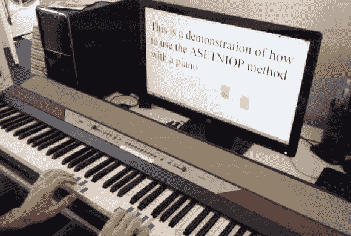

# 阿瑟尼普用钢琴键盘打字

> 原文：<https://hackaday.com/2013/03/15/asetniop-chorded-typing-with-a-piano-keyboard/>

我们不知道从钢琴键盘上输入你的脸书更新算不算练习。但是如果你想尝试一下，这里有一些方法。[扎克]给我们的提示专栏写了他最新的 [ASETNIOP hack，它使用 MIDI 钢琴键盘在电脑上触摸输入](http://www.youtube.com/watch?v=8-hZv-owHMY)。

去年七月是我们第一次听说 ASETNIOP 的时候。这是一个和弦打字系统，当时的目标是，但不限于，触摸屏设备。这个版本很好地展示了系统实际上是如何工作的。你的手指和拇指都被分配了一个键，它们永远不会离开它。要键入十个以上的字母，组合键被分配给字母表的其余部分。休息后可以看到系统的钢琴例子。但是更好的方法是将你自己的 MIDI 键盘连接到电脑上，然后[在浏览器中尝试一下](http://asetniop.com/piano.html)。

[https://www.youtube.com/embed/8-hZv-owHMY?version=3&rel=1&showsearch=0&showinfo=1&iv_load_policy=1&fs=1&hl=en-US&autohide=2&wmode=transparent](https://www.youtube.com/embed/8-hZv-owHMY?version=3&rel=1&showsearch=0&showinfo=1&iv_load_policy=1&fs=1&hl=en-US&autohide=2&wmode=transparent)