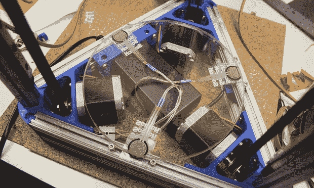

# 问黑客日:自动床水平和高温力敏电阻

> 原文：<https://hackaday.com/2014/03/19/ask-hackaday-auto-bed-leveling-and-high-temperature-force-sensitive-resistors/>

RepRap wiki [上的【Johann】有一个巧妙的解决方案](http://reprap.org/wiki/FSR) [来确保在他的 Kossel 打印机上打印任何东西之前，硼硅酸盐玻璃床是完全水平的:取三个力敏电阻器，将它们放在构建平台下，将它们并联，并将它们连接到电子板上的热敏电阻输入。校准只是马林固件中的一点代码，它使喷嘴接触床，直到热敏电阻输入达到最大值。当它这样做时，固件知道打印头已经调零，并可以计算出床的精确位置和倾斜度。](http://reprap.org/wiki/FSR)

很棒吧。一种不需要 Z 形探头、使用最少(且便宜)硬件、并且可以改装到任何现有打印机上的平台调平解决方案。但是，有一个问题:这些力敏电阻只适用于 70°C，这使得整个设置无法用于任何加热床。你的挑战是:想办法在加热床上使用这个技巧。

所用的力敏电阻—[这里有一个由[Johann]提供的链接](http://www.phidgets.com/products.php?product_id=3104)—最高工作温度为 70°C，而使用 ABS 打印时的床温约为 130°C。fsr 对温度也很敏感，这是一个非常有趣的问题。

欢迎任何有想法的人在这里、RepRap 论坛、IRC 或任何其他地方发表评论。一个想法[包括在 x 车厢](http://forums.reprap.org/read.php?340,307543,307738#msg-307738)中放置一个 FSR，但我们认为在床下和 FSRs 顶部放置某种专门的散热器会是一个更好的解决方案。

下面是自动调平技巧的视频。

[https://www.youtube.com/embed/HcnhCNh2Ln4?version=3&rel=1&showsearch=0&showinfo=1&iv_load_policy=1&fs=1&hl=en-US&autohide=2&wmode=transparent](https://www.youtube.com/embed/HcnhCNh2Ln4?version=3&rel=1&showsearch=0&showinfo=1&iv_load_policy=1&fs=1&hl=en-US&autohide=2&wmode=transparent)