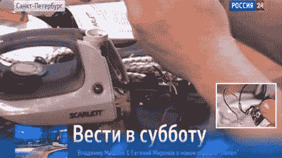

# 问问 Hackaday:你能把一个设备黑进一个间谍设备吗？

> 原文：<https://hackaday.com/2013/11/13/ask-hackaday-can-you-hack-an-appliance-into-a-spy-device/>

万圣节前几天，俄罗斯新闻网站 [Rosbalt](http://www.rosbalt.ru/piter/2013/10/22/1190990.html) (没错，是俄语)上出现了一个故事，声称俄罗斯当局截获了中国制造的电熨斗和电水壶:每个都配有麦克风和 WiFi。你可以在 BBC 的网站上阅读英文[摘要。这些“间谍设备”造成的“威胁”很可能是严重夸大的结果，如果不是针对中国制造产品的彻头彻尾的恐惧。不值得我们(或你)去猜测这里到底发生了什么，但这种情况确实是一种有趣的练习。](http://www.bbc.co.uk/news/blogs-news-from-elsewhere-24707337)

假设你想通过改变一个小的家用电器来增加你的笔测试的趣味:你能多容易地建造它？请在评论中告诉我们哪种设备最适合作为修改的“主机”,以及您将包括哪些功能。您能管理文章中列出的所有组件吗——麦克风、WiFi(有可能破解不安全的网络吗？)，再加上一些模糊的表示“传播病毒？”下面有一个视频，对有问题的电子设备有一些了解，但除非你会说俄语，否则它可能不会提供太多的见解。

[https://www.youtube.com/embed/hkiqenPy8zY?version=3&rel=1&showsearch=0&showinfo=1&iv_load_policy=1&fs=1&hl=en-US&autohide=2&wmode=transparent](https://www.youtube.com/embed/hkiqenPy8zY?version=3&rel=1&showsearch=0&showinfo=1&iv_load_policy=1&fs=1&hl=en-US&autohide=2&wmode=transparent)

[谢谢约翰内斯]