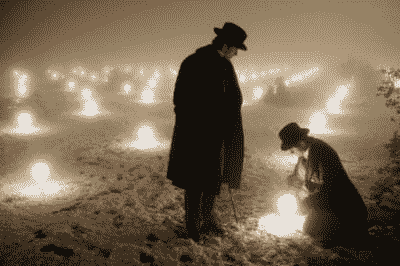
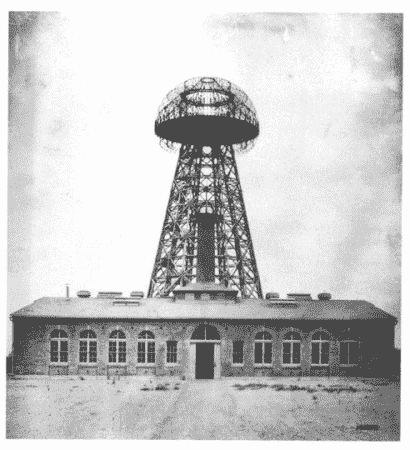

# 问 Hackaday:全球能源传输——可行吗？

> 原文：<https://hackaday.com/2014/07/07/ask-hackaday-global-energy-transmission-can-it-work/>

在科罗拉多州斯普林斯的一座小山顶上，坐落着尼古拉·特斯拉的小型临时实验室。他选择这个地方是因为空气更稀薄，因此更容易传导。泰斯拉开始相信他可以把地球当作导体，用它来传送电力，而不需要电线。虽然有些事实永远消失了，但据说在一个晴朗无月的夜晚，特斯拉扳动了开关，将数百万伏的电压送入一个高耸入云的大线圈。当噼啪作响的仪器周围形成一个诡异的蓝色光环时，他疯狂地咯咯笑着，同时大约 200 个荧光灯泡开始在 25 英里以外发光。

那天晚上，在科罗拉多州的群山中发生了一件惊人的壮举。这一壮举必将改变世界利用电力的方式。这是一项壮举，如果发挥其全部潜力，可以为地球上的每一个地方提供无线电力。这一壮举发生在大约 120 年前…

摩根大通(J.P. Morgan)当时正与约翰·洛克菲勒(John D. Rockefeller)和安德鲁·卡内基(Andrew Carnegie)争夺谁的私处最大，当他联系特斯拉时，他可能不太关心特斯拉无线输电的伟大想法的影响。在读了《世纪》杂志上关于这项实验的一页后，摩根对它的盈利能力产生了兴趣，并向特斯拉提供了一些急需的资金。

这就把我们带到了著名的沃登克利夫大厦，它建于 1901 年，位于纽约长岛。特斯拉告诉摩根，他可以把信息一直传到欧洲。长话短说——没用。在大洋彼岸，有个叫古列尔莫·马可尼的人，利用了 Telsa 的 17 项专利，制造出了世界上第一台能正常工作的收音机。而且成本远比特斯拉的塔便宜。

一个世纪后，我们在这里，两个俄罗斯工程师想做尼古拉·特斯拉做不到的事情。我们想知道的是:*有没有可能*。他们声称这是当然的。他们已经用少量的资金取得了一些进展。现在他们想建造它。重新建造它。他们想用现代技术建造另一座“沃德克立夫塔”，包括一座 Arduino。最初的塔超过 60 吨。他们的只有两吨重。他们说，他们可以把这些塔遍布世界各地，并获得全球人口的无线电力。但这行得通吗？

所以拿出你的计算器和物理书。我们想知道——[有没有可能](http://globalenergytransmission.com/index.php/en/latest-news/61-simplified-explanation-of-the-working-principle-of-planetary-energy-transmitter)？

[https://www.youtube.com/embed/L4fJWE3rnt4?version=3&rel=1&showsearch=0&showinfo=1&iv_load_policy=1&fs=1&hl=en-US&autohide=2&wmode=transparent](https://www.youtube.com/embed/L4fJWE3rnt4?version=3&rel=1&showsearch=0&showinfo=1&iv_load_policy=1&fs=1&hl=en-US&autohide=2&wmode=transparent)