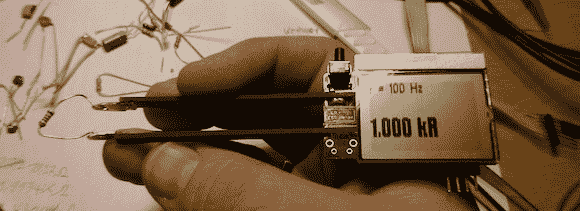

# 问 Hackaday:你如何放弃一个项目？

> 原文：<https://hackaday.com/2012/12/28/ask-hackaday-how-do-you-give-a-project-away/>

几周前，[我们从[Kai]的工作台上听说了一款 DIY 版的“智能镊子”](http://hackaday.com/2012/11/07/measuring-smd-parts-with-a-home-brew-version-of-smart-tweezers/)，它能够测量 SMD 电阻、电容和电感。那时，[Kai]还没有完全完成他的构建的软件部分，留给他的是一堆零件和不能工作的 PCB。代码现在已经完成，这意味着【凯】[拥有了一个非常强大且非常便宜的版本](http://www.xyphro.de/blog/comments.php?y=12&m=12&entry=entry121227-233617)【LCR】米镊。他想回馈开源社区，并找到一种方法让他的镊子现在到世界各地的制造商手中。唯一的问题是他不知道该怎么做。

在之前，我们已经看到过智能镊子，它们仍然可以以大约 300 美元的价格买到。[凯]的版本大大降低了价格，所以这些 LCR 镊子是有市场的。看起来，问题在于如何制造这些镊子。

我们假设焊接成千上万的 SMD 部件不是[Kai]认为的好时机；这使得 Kickstarter 成为一个失败的创业者，除非他能把生产外包出去。Seeed Studio 可能是[Kai]出售商品的好地方，但我们想知道 Hackaday 的读者在[Kai]的情况下会怎么做。显然，他应该通过许可或版税获得工作报酬，但至于实际的建议和推荐，我们转向了 Hackaday 读者。