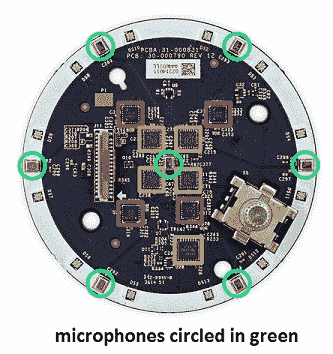

# 问 Hackaday:亚马逊 Echo 是家庭自动化的未来吗？

> 原文：<https://hackaday.com/2015/04/14/ask-hackaday-is-amazon-echo-the-future-of-home-automation/>

除非你一直生活在 1 法拉电容器的盒子下，否则你一定听说过亚马逊回声。Echo 大约有两罐豆子那么大，对于这样一个小包装来说，它的冲击力相当大。它由德州仪器 DM3725 处理器提供动力，搭载 256 兆 RAM 和 4g SanDisk in 和 ultra flash 存储器。高通 Atheros 负责 WiFi 和蓝牙，各种 TI 芯片负责音频编解码器和放大器。

Echo 的独特之处在于其惊人的语音识别能力。虽然 Echo 的“大脑”存在于互联网上的某个地方，但这个电路的硬件却非常简单。七个，是的，七个麦克风位于设备顶部周围。它们馈入四个德州仪器(92dB SNR 低功耗立体声 ADC。硬件和软件构成了一个非常强大的语音识别系统，可以在房间的任何地方工作。对于输出声音，使用了两个扬声器-一个低音扬声器和一个高音扬声器。它们都通过 TI 15 瓦 D 类放大器供电。查看此[全拆](https://www.ifixit.com/Teardown/Amazon+Echo+Teardown/33953)了解硬件的更多细节。

现在我们对硬件有了一个很好的想法，我们不得不接受这个坏消息，这是一个闭源设备。虽然我们已经看到了其他一些通过非官方 API 来调查待办事项列表的方法，但仍有许多不足之处。例如，唤醒词，或信号回声开始听命令的词，是“Alexa”或“Amazon”。没有其他方法可以改变这一点，尽管在软件中应该很容易做到。显而易见，人们会希望称它为“计算机”或“贾维斯”。但是不要担心我的黑客朋友，因为我有好消息！

似乎亚马逊看到了(或者一直以来都看到了)家庭自动化是 Echo 的未来。他们现在[正式支持](http://www.engadget.com/2015/04/08/amazon-echo-controls-philips-hue-belkin-wemo/)飞利浦 Hue 和 Belkin WeMo 小工具。Belkin WeMo 对[黑客的工作台](http://hackaday.com/2013/02/23/wemo-without-a-smartphone/)并不陌生，它已经很好地处理了家庭自动化，使控制你房子里的东西的能力与回声近在咫尺。看下面我测试的视频。现在，如果你还不兴奋，你可能还没听说过 [WeMo 制造商](http://www.belkin.com/us/F7C043-Belkin/p/P-F7C043;jsessionid=79E56577038998FD6B98A39955423A4B/)，一种他们声称可以让你*控制几乎任何低压电子设备*的设备。虽然 WeMo Maker 目前还不受支持，但在不久的将来肯定会得到支持。

我们知道这很糟糕，所有这些都是封闭的源代码。但是它确实很酷！那么问题来了:Echo 是家庭自动化的未来吗？当然，它有明显的缺陷，人们会认为家庭自动化并不是亚马逊最直接的商业模式(他们只是想让你买东西)。然而，它作为家庭自动化核心工作得非常好。可能性比现在任何东西都好——不管是封闭的还是开源的。

你认为亚马逊会敞开大门让 Echo 运行开源模块，允许社区添加对任何无线设备的控制吗？你认为这样做会让亚马逊在未来几年成为家庭自动化之王吗？

[https://www.youtube.com/embed/L21zONaigaw?version=3&rel=1&showsearch=0&showinfo=1&iv_load_policy=1&fs=1&hl=en-US&autohide=2&wmode=transparent](https://www.youtube.com/embed/L21zONaigaw?version=3&rel=1&showsearch=0&showinfo=1&iv_load_policy=1&fs=1&hl=en-US&autohide=2&wmode=transparent)