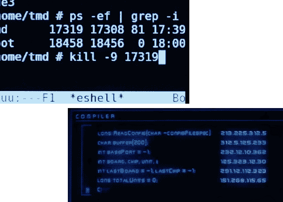

# 问 Hackaday:什么电影有最好/最差的黑客场景

> 原文：<https://hackaday.com/2013/03/19/ask-hackaday-what-movies-have-the-bestworst-hacking-scenes/>

当你在大屏幕黑客场景中为垃圾或胜利辩护时，是时候给[漫画家]留下最好的印象了。我们看了很多电影，当电影制作人偷工减料，对使用计算机的实际情况不做任何研究时，我们很难不抱怨。但偶尔你会有一个团队尽职尽责，为我们这些了解内情的人搭建一个场景。所以我们想知道，你认为哪些电影有最好的黑客场景，哪些是最糟糕的罪犯？在评论区留下你对这个话题的看法。

我们意识到你可以提出大量做得不好的建议，我们真正想听到的是谁做得对。我们将从几个例子开始。左上角的图像是来自 *Tron: Legacy* 的一个场景，我们认为它很好地描绘了实际的计算机使用情况。你可以[在这篇文章](http://jtnimoy.net/?q=178)(通过 [Reddit](http://www.reddit.com/r/linux/comments/170eke/emacs_is_the_most_important_vfx_in_tron_legacy/) )中读到更多关于投入其中的大量工作的信息。

右下角是我想到的最阴暗的电影场景之一。在电影《箭鱼》中，[休·杰克曼]被迫接受[约翰·特拉沃尔塔]的“黑客攻击”。屏幕上方的标题是“编译器”，谁知道其余部分应该是什么？

在硬件黑客方面，这变得有点困难，我们喜欢一些正确完成的*硬件黑客或模块*的例子。