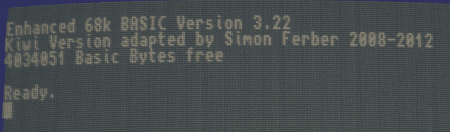

# 问 Hackaday:谁喜欢逆向计算？

> 原文：<https://hackaday.com/2012/09/15/ask-hackaday-who-likes-retrocomputing/>

上周[我们发布了一个到 Project Kiwi](http://hackaday.com/2012/09/08/building-the-best-homebrew-computer-ever/) 的链接，这是一个由【Simon】制造的基于家酿摩托罗拉 68008 的微型计算机，包括以太网、一个非常好的显示适配器、一个 IDE 硬盘接口、两个 Commodore SID 芯片(用于立体声芯片调谐)、一个软盘控制器和一个已经存在的软件库，它将使为这个奇妙的计算机开发自己的软件变得非常容易。

在思考了[西蒙]的奇异果项目一段时间后，我一直在想，真的没有一台自制的计算机对于一个适当的开放硬件版本来说是如此完美。电脑中有足够多的外围设备让开发变得非常有趣。我已经建议进行一次团购，把新西兰的多氯联苯放到野外，送到其他反电脑狂热者的手中，但是[西蒙]想要更多的反馈。

当然，这意味着求助于你，这位出色的 Hackaday 读者。你们中有人对自己的猕猴桃微型计算机感兴趣吗？

[Simon]告诉我把 Kiwi 微型计算机变成一个开放的硬件项目有很多问题。他的 PCB 原型花了€300 英镑，这大大减少了有兴趣自己制作猕猴桃的人数。此外，当前的 PCB 设计存在一些问题(很容易在下一个版本中修复)，并且[Simon]希望添加一些功能，如 DMA 和适当的帧缓冲区。

尽管有这些问题，我找不到更好的方法来艰难地学习计算机架构(即 80 年代的微型计算机，而不是无所事事地玩树莓派)。你还会得到一个非常棒的计算机系统，它将展示 80 年代电子产品的威力，用古老的 Saint MC68000 传播逆向计算的福音。

如果你想补充你的意见——如果拥有一台开放硬件的 80s 微型计算机是一个好主意，或者一些技术要求，例如为未来的设计添加一个合适的 68000 CPU，请在评论中或在他的 Kiwi 页面上建立的论坛【Simon】[上留言。](http://www.ist-schlau.de/phpBB3/)

我认为这是一个很酷的想法，但话说回来，我可能被这种 80 年代的电脑有多酷蒙蔽了双眼。这个项目的命运现在掌握在你的手中。