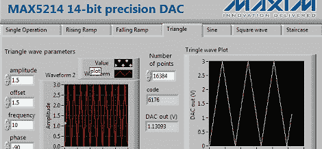

# 问 Hackaday:谁想建立一个函数生成器？

> 原文：<https://hackaday.com/2012/07/04/ask-hackaday-who-wants-to-build-a-function-generator/>

[tari] [发送了一条关于 MAX5214 DAC 评估板 AVNET 将于今年夏天发布的提示](http://www.taricorp.net/2012/max5214-eval-board)。 [MAX5214 / MAX5216](http://www.maxim-ic.com/datasheet/index.mvp/id/7119) 是一款小巧的芯片，在小型 8 引脚封装中提供 14 或 16 位 DAC 和串行接口。[tari]认为这个评估板可以被破解成一个函数发生器，我们必须同意这一点。现在，谁想造一个？

完全有可能将 MAX5214 芯片放入一个带有小型 ARM uC、显示器和几个旋钮的电路中，但这似乎是浪费时间，因为这种口径的函数发生器[已经上市](http://www.youtube.com/watch?v=q9X9Q5E88ZI)，价格约为 60 美元。看来最有效的方法是在开发板的输出端增加一个放大器，并可能编程一个比现有 LabView 软件更好的接口。

如果你想修补一些免费的硬件，并在这个过程中做一些有用的东西，试试用这个开发板做一个函数发生器。完成后，请务必在中[发送。](http://hackaday.com/contact-hack-a-day/)