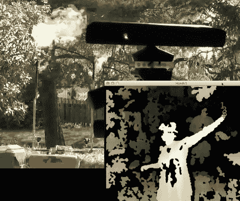

# ATiny 动力 Kinect 消防炮，用于舞蹈特效

> 原文：<https://hackaday.com/2012/05/02/atiny-powered-kinect-fire-cannons-for-dance-fx/>

[Paul]又在用一些[Kinect 控制的 fire poffers](http://www.youtube.com/watch?v=n90rMzVo8jw)了。你可能还记得【保罗】以前对[巨型手工制作的液压火焰航行海盗船](http://hackaday.com/2011/08/25/burning-man-pirate-ship-sports-arduino-powered-flame-sails/)的恶作剧。这一次，他正在为浸泡制作一个小型火焰喷壶(可能是一系列喷壶)，浸泡是俄勒冈州的一个地区性(无党派)火人节。

任何记得建造的人都会认出新加农炮的大脑，它们只是海盗船的定制板，被毫不客气地从他们以前的家里拆下来，回收给新的控制器。不过这次他们有 Kinect！这个版本的功能看起来很像邪恶天才模拟器，只是简单地使用一个高度阈值来激活每门大炮，但是[保罗]对新系统有计划。这个硬件测试使用的是封闭源代码的 OpenNI，但当它在几周前刚刚发布的 [SkelTrack、](https://github.com/joaquimrocha/Skeltrack)中重生时，将会发挥其全部潜力。大炮将围绕一个小的单人舞池，大概 Kinect 就在附近。

查看跳跃后的简短测试视频。

[https://www.youtube.com/embed/n90rMzVo8jw?version=3&rel=1&showsearch=0&showinfo=1&iv_load_policy=1&fs=1&hl=en-US&autohide=2&wmode=transparent](https://www.youtube.com/embed/n90rMzVo8jw?version=3&rel=1&showsearch=0&showinfo=1&iv_load_policy=1&fs=1&hl=en-US&autohide=2&wmode=transparent)