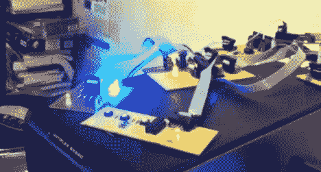

# ATmega1284 是一款 8 语音 32 KHz 合成器

> 原文：<https://hackaday.com/2012/11/02/atmega1284-as-an-8-voice-32-khz-synthesizer/>

这款 8 声部 32 千赫合成器给我们留下了几个印象。首先是原型的清洁度。正如您所看到的，每个器件在自己的板上都有足够的空间，所有器件都通过 10 引脚 IDC 带状连接器互连。但是你将不得不在休息后观看视频来欣赏它发出的令人印象深刻的声音。你会听到它播放超级马里奥兄弟主题；它充满激情地去做！

为了从数字微控制器中获取音频，迈克建造了自己的 R2R 数模转换器。电阻阶梯由 16 个电阻构成，为轨到轨放大器供电。声音是单声道的，但由于 ATmega1284 的工作，回放是复音的。它正在读取来自外部控制器(我们假设是硬件所在的计算机)的 MIDI 命令。芯片的 128 KB 闪存留有足够的空间来存储样本，这些样本是根据 MIDI 数据从查找表中选择的。如果要播放多个样本，芯片会对数据进行平均，并相应地设置 8 位输出端口。

[https://www.youtube.com/embed/fsfTvRY21Wk?version=3&rel=1&showsearch=0&showinfo=1&iv_load_policy=1&fs=1&hl=en-US&autohide=2&wmode=transparent](https://www.youtube.com/embed/fsfTvRY21Wk?version=3&rel=1&showsearch=0&showinfo=1&iv_load_policy=1&fs=1&hl=en-US&autohide=2&wmode=transparent)