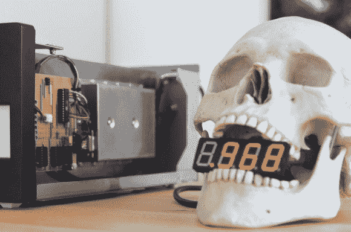

# 原子钟提醒我们，我们正在死去

> 原文：<https://hackaday.com/2013/03/26/atomic-skull-clock-reminds-us-were-dying/>

不管你喜不喜欢，过去的每一秒都让你离自己的灭亡更近一步。这不是一个令人欣慰的话题，但这是现实。这个名为“死亡纪念品”的艺术装置令人难忘地想起了那件事。即使我们今天拥有所有的先进技术，我们仍然完全没有办法知道我们的时代何时会到来*。*

[马丁]铸造了一个真正的人头骨，然后添加了一个 4 位数的 LED 显示器，它连接到一个[铷原子钟](http://en.wikipedia.org/wiki/Rubidium_atomic_clock)(运行 FE-5680A 频率标准)。显示屏一秒一秒地倒计时，以毫秒为单位，从 1.000 到 0.001。他构建了一个定制的电子电路，将 10 MHz 的正弦波转换为 1 kHz 的脉冲信号，并使用运行 Arduino 草图的 ATmega8 芯片来完成剩下的脏工作。

看着休息后的视频，背景是那流畅神秘的音乐，不禁令人深思我们的死亡率。就个人而言，这完全像是你在电子游戏中找到的东西。

[谢谢马丁]

[https://www.youtube.com/embed/5GgHqeaRl3k?version=3&rel=1&showsearch=0&showinfo=1&iv_load_policy=1&fs=1&hl=en-US&autohide=2&wmode=transparent](https://www.youtube.com/embed/5GgHqeaRl3k?version=3&rel=1&showsearch=0&showinfo=1&iv_load_policy=1&fs=1&hl=en-US&autohide=2&wmode=transparent)