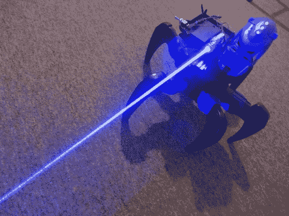

# 攻击目标变成激光死亡无人机

> 原文：<https://hackaday.com/2013/12/16/attacknid-becomes-laser-death-drone/>

[styroPyro]喜欢他的攻击，但决定只需要多一点蓝色死亡射线激光。在之前，我们已经见过【styroPyro 的】【T2 的】高能激光黑客，但这次他开始攻击【T4 的】【杰米·曼特泽尔的】攻击机器人之一。根据[styroPyro]视频中的一条顶级评论 Attacknid 发明者[Jaimie]本人的评论——机器人本来就是要被黑客攻击的，而[Jamie]欣喜若狂。

[styropyro]从他的攻击中取出了圆盘射击器，并用火力控制电路激活了一个 2 瓦的蓝色激光。一个低功率的红色激光笔充当激光瞄准器，让你在释放强大的蓝色激光之前瞄准目标。正如视频所示，2 瓦是一个很大的功率。攻击者很容易戳破气球并点燃闪光纸。像往常一样，我们敦促您在处理 2 瓦激光时要小心，这属于第 4 类:也就是最危险的激光。护目镜、皮肤保护装置和安全联锁装置是当今的主流。[styroPyro]从事高功率激光研究已经有几年了，他似乎知道自己在做什么。也就是说，我们将把燃烧的激光留给专业人士。

[https://www.youtube.com/embed/QR7vwRC6SFE?version=3&rel=1&showsearch=0&showinfo=1&iv_load_policy=1&fs=1&hl=en-US&autohide=2&wmode=transparent](https://www.youtube.com/embed/QR7vwRC6SFE?version=3&rel=1&showsearch=0&showinfo=1&iv_load_policy=1&fs=1&hl=en-US&autohide=2&wmode=transparent)