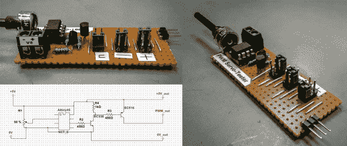

# Attiny PWM 发生器和伺服测试仪

> 原文：<https://hackaday.com/2014/06/08/attiny-pwm-generator-and-servo-tester/>

拥有合适的工作工具至关重要，尤其是对于我们在 Hackaday 上重点介绍的项目类型。[Jana Marie]肯定同意这种观点，她的最新项目之一涉及构建一个工具来[生成 PWM 信号并使用 Attiny25/45/85 测试伺服系统](http://www.instructables.com/id/Attiny254585-PWM-generator-and-Servo-tester/)。

工具有各种[种](http://hackaday.com/2014/06/04/helix-turning-tool-born-from-necessity/)的[不同的](http://hackaday.com/2014/03/03/gritz-an-open-source-speed-reading-tool/)形状和[大小](http://hackaday.com/2014/04/18/auto-roll-up-tool-storage/)。即使它可能不会像[Jana]早期的工作那样广泛使用，即[结合了示波器和信号发生器](http://hackaday.com/2014/05/27/an-audio-based-usb-oscilloscope-and-signal-generator-for-20/)，拥有一个可以依赖的工具来测试伺服系统并生成 PWM 也是非常有用的。这个写得很好的 Instructable 提供了所有你需要构建自己的细节，包括原理图和必要的代码(可以在 GitHub 上找到[)。最终的 PWM 发生器看起来很棒。对于简单的项目，有时一个原型板就足够了。如果将来能看到为这个项目定制的 PCB，那将会非常酷。](https://github.com/Jana-Marie/Attiny-PWM-generator)

你最近制作了什么工具？事实上，每个问题都有一个工具。在工具箱之外思考，然后[让我们知道](http://hackaday.com/contact-hack-a-day/)你做了什么！