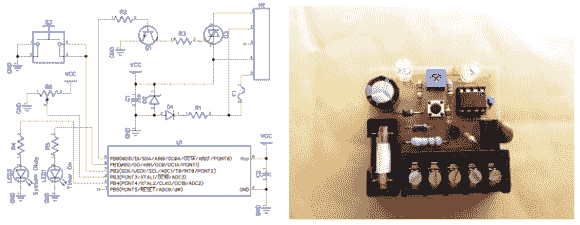

# 当你忘记的时候，一个定时浇水器会把水关掉

> 原文：<https://hackaday.com/2014/08/10/attiny-watering-timer-turns-off-the-water-when-you-forget/>

(凯尔的)一个朋友经常让他的洒水器开得太久。他还忘了关水龙头，这是一个尴尬又浪费的情况。作为一个如此好的朋友，[凯尔]主动给他做了一个[定时器](http://www.wengenroth.co/projects/automatic-water-timer/)。这不是一个每天同一时间开关水的普通定时器。该设备允许用户按下按钮，使装置打开电磁阀，允许水流。经过一段预定的时间后，该装置切断电磁阀的电源，从而停止水流，成功地防止了水池溢流和过度浇水。

[凯尔]开始他的设计使用 555 芯片做计数。他很快担心，由于电容的漏电流和电阻的充电电流，超过 10 分钟的定时器长度会导致功能不一致。有办法解决这个问题，但他没有让设计变得复杂，而是改用 ATtiny 微控制器。ATtiny 的额外好处是，他可以连接一个电位计来调整导通时间，而无需更换零件或制作新的单元。当电位计转动时，车载 LED 将闪烁多次，对应于分钟的延迟。十次闪烁意味着 10 分钟的延迟。这是一个简单明了的界面。

如果家里蚀刻的 PCB 不够酷，[凯尔] 3D 打印了一个单位的情况。外壳允许接触螺丝端子，并提供指示灯。看看箱子顶部的集成翻盖。当外壳的这一部分被推入时，它会按下安装在 PCB 上的开/关开关。

如果你有兴趣制作一个，所有的文件和代码都可以在[【凯尔的】网站](http://www.wengenroth.co/projects/automatic-water-timer/)上找到。

[通过【危险原型】](http://dangerousprototypes.com/2014/08/06/diy-automatic-water-timer/)