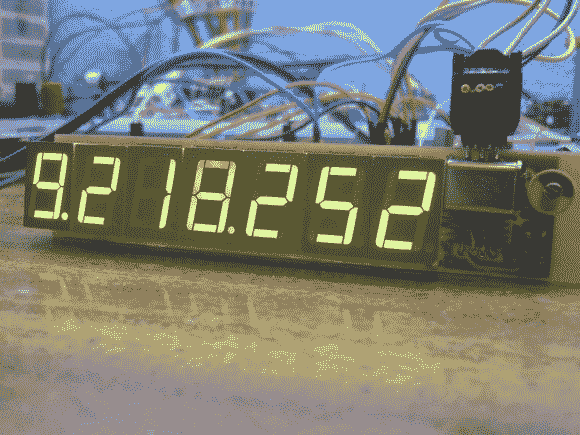
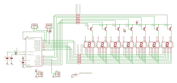

# ATtiny2313 频率计测量 1Hz-10MHz

> 原文：<https://hackaday.com/2013/03/24/attiny2313-frequency-meter-measures-1hz-10mhz/>

[这个频率计项目](http://mdiy.pl/miernik-czestotliwosci-na-avr-od-1hz-do-10mhz/?lang=en)榨取了 ATtiny2313 微控制器的大量性能。该芯片完成所有工作，测量输入引脚上的频率，并多路复用 7 个七段显示器来读取测量结果。

该系统的精度取决于 AVR 芯片使用的时钟晶振，因此[Manekinen]建议使用具有最佳容差的晶振。还需要选择一个可被 1024 整除的值，以获得精度和分辨率的最佳组合。在这种情况下，他使用 22.1184 MHz 的晶体振荡器，这是芯片的轻微超频，其规格为最大 20 MHz。

我们没有完全理解他关于两个计时器如何用于计数的解释。但是，如果我们真的想深入了解他的代码(用 BASCOM-AVR 编写)是可用的。如果你只是对硬件感兴趣，我们在休息后嵌入了原理图的截图。

