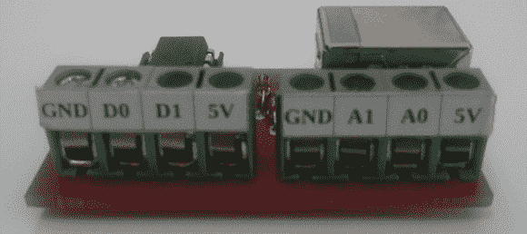

# ATtiny85 数据采集

> 原文：<https://hackaday.com/2014/04/29/attiny85-data-acquisition/>

Ivmech 的人最近需要一些新硬件。他们需要一个小而便宜的设备，能够检测一些模拟值，切换几个数字引脚，并将一切记录到计算机中。他们想出的是 IViny，一种围绕 ATtiny85 构建的极小的数据采集设备，能够将数据记录到计算机中。

IViny 具有两个数字通道和两个 10 位模拟通道，就像你在任何 ATtiny85 项目中发现的一样。电源通过 USB 提供，与计算机的连接由 V-USB 提供。还有一个非常酷的 Python 应用程序,它与项目一起能够绘制模拟输入并控制设备上的数字 I/O。

它并不是一个快速的设备-固件仅支持每秒 100 个样本，但即将到来的固件升级将改善这一点。不过，如果你需要读取一些模拟值或切换几个便宜的引脚，这是一个很好的小 USB 瑞士军刀。