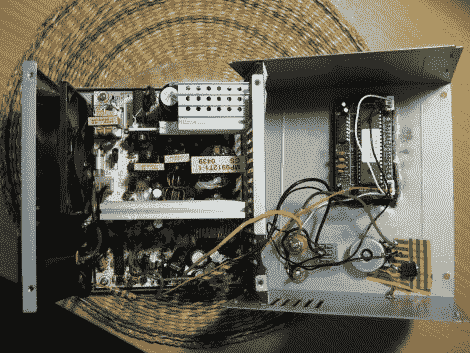

# ATX 台式转换保留安全功能，提供大量的电流。

> 原文：<https://hackaday.com/2012/07/17/atx-benchtop-conversion-retains-safety-features-delivers-plenty-of-current/>

[Bogin]希望在他的一系列工具中添加一个台式电源，但他并没有发现任何在线教程有所帮助。他发现的大多数都是简单的重新布线工作，利用 LM317 调节器和短路的 PS-ON 引脚来保持 PSU 愉快地突突前进，好像什么都没有改变。不，【博金】想要的是[一个具有短路保护和电流负载的严肃电源。](http://boginjr.com/electronics/lv/atx-mod/)

他通过拆卸使用半桥设计的 300 瓦 ATX 电源开始转换。在确定了控制器芯片(本例中为 TL494)后，他开始调整控制电源输出的 PWM 反馈电路。这里剪几下，那里用烙铁焊几下，[博金]就准备好测试他的发明了。

他说，即使在重载下，它也能很好地工作。他的教程是专门针对这类 PSU 的，所以我们非常乐意介绍那些实现其他设计拓扑的类似工作。与此同时，请务必查看以下被黑电源的视频。

[https://www.youtube.com/embed/3LBsFrbPzb8?version=3&rel=1&showsearch=0&showinfo=1&iv_load_policy=1&fs=1&hl=en-US&autohide=2&wmode=transparent](https://www.youtube.com/embed/3LBsFrbPzb8?version=3&rel=1&showsearch=0&showinfo=1&iv_load_policy=1&fs=1&hl=en-US&autohide=2&wmode=transparent)