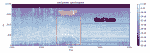

# 音频算法检测您的团队何时得分

> 原文：<https://hackaday.com/2015/04/24/audio-algorithm-detects-when-your-team-scores/>

[弗朗索瓦]住在加拿大，正如你所料，他喜欢曲棍球。由于他所在的当地球队(Habs)进入了季后赛，他决定为他的客厅制作一个令人敬畏的装置，每当他的球队得分时，它就会上演一场灯光表演。如果有一个好的 API 在进球时通知他，这就简单了，但是他找不到这样的东西。相反，他设计了一种[机器学习算法，通过收听他的电视音频来检测他的主队何时得分](http://blog.francoismaillet.com/epic-celebration/)。

【弗朗索瓦】从听一些录制游戏的音频开始。每当有进球，解说员就大喊一声，进球号角就响了。这对听者来说很明显是进球了，但是用电脑检测就有点困难了。【弗朗索瓦】还想检测自己的主队什么时候进球，而不是对方球队什么时候进球，让问题更加复杂！

由于解说员的喊叫和进球号角对于每个进球来说听起来并不完全相同，[Fran ois]决定编写一个算法，从音频中识别和学习模式。如果检测到主队进球，他会向一些菲利普斯灯泡发出命令，让它们闪烁自己球队的颜色。当对方球队得分时，他的算法尽最大努力避免误报，在实践中，它成功地识别了 75%的主队进球，误报率为 0——不错！请务必在休息后查看运行中的设置。

[https://www.youtube.com/embed/tmh_eAq9yp4?version=3&rel=1&showsearch=0&showinfo=1&iv_load_policy=1&fs=1&hl=en-US&autohide=2&wmode=transparent](https://www.youtube.com/embed/tmh_eAq9yp4?version=3&rel=1&showsearch=0&showinfo=1&iv_load_policy=1&fs=1&hl=en-US&autohide=2&wmode=transparent)