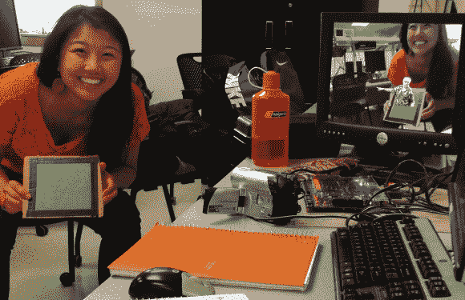

# 用 FPGA 实现增强现实

> 原文：<https://hackaday.com/2014/05/16/augmented-reality-with-an-fpga/>

[Julie Wang]在现场可编程门阵列(FPGA) 上创建了一个[增强现实系统。](http://people.ece.cornell.edu/land/courses/ece5760/FinalProjects/s2014/jsw267/html/html/)[增强现实](http://en.wikipedia.org/wiki/Augmented_reality)并不新鲜——见鬼，如今[甚至你的平板电脑也能做到](http://hackaday.com/2013/11/06/augmented-reality-breadboarding/)。[Julie]采取了一种稍微不同的方法。她根本不用处理器。她的整个系统，从捕捉，到图像处理，到 VGA 信号输出，都在一个 FPGA 中实例化。

使用该系统就像拿起一块绿色的方形纸板一样简单。通过一台旧摄像机观察世界，[朱莉的]项目检测并跟踪绿色方块。然后，它在果岭上添加了康奈尔大学麦格劳塔的 3D 图像。塔随着纸板移动，看起来就在那里。[Julie]通过选择用这座塔代替她的教授[[Bruce Land]](http://people.ece.cornell.edu/land/)的形象，给这个项目注入了一点幽默。

[Julie]从 NTSC 视频信号开始。视频由带有 Altera Cyclone IV FPGA 的 [DE2-115 板捕获。信号进入 FPGA 后，[Julie 的]代码会执行中值滤波。颜色检测器找到绿色像素的区域，该区域被传递给角跟随器和角中值滤波器。塔或布鲁斯图像从 rom 加载并覆盖在视频流上，然后通过 VGA 输出。](http://www.altera.com/education/univ/materials/boards/de2-115/unv-de2-115-board.html)

令人惊讶的是，没有任何微处理器参与任何处理。逻辑和状态机控制着演出。干得好[Julie]，我们希望[Bruce]给你一个 A！

[https://www.youtube.com/embed/shh8ySmrpKo?version=3&rel=1&showsearch=0&showinfo=1&iv_load_policy=1&fs=1&hl=en-US&autohide=2&wmode=transparent](https://www.youtube.com/embed/shh8ySmrpKo?version=3&rel=1&showsearch=0&showinfo=1&iv_load_policy=1&fs=1&hl=en-US&autohide=2&wmode=transparent)