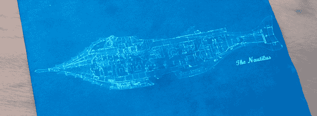

# 真实的蓝色蓝图

> 原文：<https://hackaday.com/2014/03/21/authentic-blue-blueprints/>

在历史上，蓝图实际上是蓝色的。现在，如果你看到一个死树版本的平面图或装配图，它们可能是用绘图仪或大幅面打印机打印出来的。然而，你可以[在家里](http://hackaday.io/project/546-Authentic-Blueprints)制作自己的蓝图，正如【泰勒】在他的 Hackaday 项目中向我们展示的那样。

在过去的日子里，主图被描绘在大片透明胶片上。然后将这些母版印刷品铺在用铁氰化钾和柠檬酸铁铵制备的纸上，为印刷品创建不可溶解的普鲁士蓝背景。显影很容易——只需将透明的正片和未显影的纸张暴露在紫外线下，比如荧光灯或阳光。

[泰勒]开始了他的蓝图创作过程，他得到了几张[RSI Aurora](http://media.moddb.cimg/games/1/22/21449/a4.png)和[Nautilus](http://pic40.picturetrail.com/VOL280/1814166/4884796/363663506.jpg)的设计草图，在电脑上进行编辑，并打印在透明纸上。将等份铁氰化钾和柠檬酸铁铵的溶液涂在一张纸上，并让其干燥。曝光很简单，就是把透明胶片放在未显影的纸上，在阳光下晒 20 分钟左右。之后，很简单的事情就是洗掉未曝光的化学物质，让新创建的蓝图干燥。

这是一个简单的技术，但也非常非常酷。不太实际，因为绘图仪可以在几分钟内绘制出任何建筑、车辆或设备的建筑或装配图，但这只是艺术品或极其古怪的工程师的入场券。

谢谢[莎拉]送来这个。