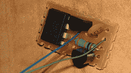

# 自动关闭任何电路

> 原文：<https://hackaday.com/2013/03/17/auto-off-for-any-circuit/>

正确配置后，当长时间无人看管时，您的计算机将进入睡眠模式。你的手机也是如此，几乎所有其他足够复杂的电子产品也是如此。尽管如此，简单得多的电路仍受 SPST 开关的支配；如果你忘记关掉手电筒，下次你需要用它的时候，它就没电了。想要一个自动关闭电路简单的电子设备，[凯尔]组装了这个自动关闭电路。

该电路背后的基本思想是使用微控制器作为定时器来控制两个晶体管。当[Kyle]的电路进行电源循环时，AVR 内部的定时器启动，使引脚变为高电平，当定时器到时，使引脚再次变为低电平。此引脚馈入 PNP 晶体管，该晶体管又连接到 NPN 晶体管，为任何带有 SPST 开关的设备创建一个非常小的自动关闭电路。

[Kyle]说需要做一些改进——使用 MOSFETS 来处理更高的电流，并可能使用更小的微控制器，如 ATtiny 4/5/9/10 来缩小电路的体积。这是一个伟大的想法，将自动关闭手电筒的想法变成了现实。