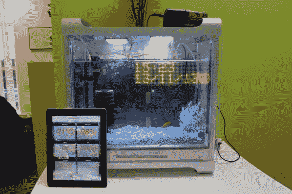

# 自动化水族馆是厨房水槽

> 原文：<https://hackaday.com/2013/11/15/automated-aquarium-is-kitchen-sinky/>

几年来，人们一直在将他们的旧 Power Macs 和 Mac G5s 转换成鱼缸，但[[海登]的互联网坦克](http://www.haydenkibble.com/the-internet-enabled-fishtank/)可能是有史以来最棒的与水和鱼一起塞进水族馆的坦克——今年夏天我们已经看到了一些[令人着迷的建筑。在掏空 G5 和覆盖基本的丙烯酸工作后，[海登]开始堆积电子设备:网络摄像头，定时 LED 照明，用于状态读数的 LCD，通过伺服系统控制的过滤器和气泡，测量水位的超声波传感器，温度计，滚动矩阵显示器，自动喂食机制，等等。他甚至溜进了 G5 的旧主板，仅仅是为了一个凉爽的背景。](http://hackaday.com/2013/07/31/pair-of-aquarium-builds-are-masterpieces-inside-and-out/)

该建筑使用了树莓 Pi 和 Arduino Mega，它们位于底部的水箱下面。Pi 提供了一个用 PHP 和 jQuery 编写的 web 界面，它向您显示水箱的状态，并允许您更改一些设置。几乎每个组件都接受了某种形式的修改。[Hayden]将网络摄像头从其外壳中剥离出来，并用一块丙烯酸树脂和大量硅胶替换外壳，使其既防水又足够纤薄，以适合合适的位置。尽管他决定坚持使用亚马逊购买的 Eheim 喂鱼器，但他关闭了该装置的自动喂食计时器，并点击手动“喂食”按钮，将其集成到自己的系统中。

这要用半个头版来解释剩下的事情。我们决定让水族馆在下面的视频中告诉你它的其他特征。是的……它会说话。

[https://www.youtube.com/embed/2HFDjCWGLMQ?version=3&rel=1&showsearch=0&showinfo=1&iv_load_policy=1&fs=1&hl=en-US&autohide=2&wmode=transparent](https://www.youtube.com/embed/2HFDjCWGLMQ?version=3&rel=1&showsearch=0&showinfo=1&iv_load_policy=1&fs=1&hl=en-US&autohide=2&wmode=transparent)