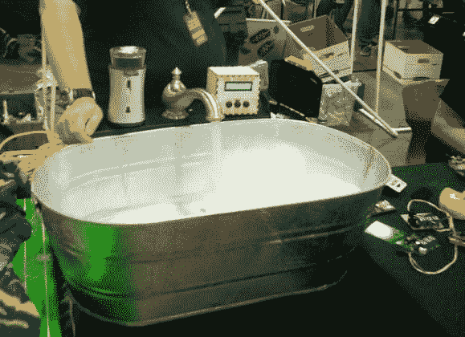

# 自动浴缸按照您喜欢的方式准备您的浴缸

> 原文：<https://hackaday.com/2014/08/04/automated-bathtub-prepares-your-bath-just-the-way-you-like-it/>

我们生活在未来，不是吗？为什么只有富人才有触摸屏控制的淋浴和温度调节的浴缸？[Raptor_Demon]向我们展示了如何使用我们最喜欢的微处理器 Arduino 来制作我们自己的便宜的自动化浴缸。

该系统控制浴缸的注水，根据用户资料监控温度，甚至还会添加气泡。你为什么需要这个？你可能不知道——但为什么不呢，按一个按钮，就有一个浴缸为你打开，这不是很好吗？它使用一个 Arduino 兼容板来控制供水系统的 3 个继电器，一个 DS18b20 温度传感器位于入口处，另一个无线(434mhz) Arduino 兼容板用于监控浴缸温度，并使用黑客攻击的自动皂液机添加泡沫浴。

[Raptor_Demon]在 2013 年和 2014 年的 NC Maker Faire 上展示了他的原型，获得了巨大的成功。他甚至有一个全尺寸的浴缸，他可以在解释的时候坐在里面——看看这个！

[https://www.youtube.com/embed/zkEBTZInMH4?version=3&rel=1&showsearch=0&showinfo=1&iv_load_policy=1&fs=1&hl=en-US&autohide=2&wmode=transparent](https://www.youtube.com/embed/zkEBTZInMH4?version=3&rel=1&showsearch=0&showinfo=1&iv_load_policy=1&fs=1&hl=en-US&autohide=2&wmode=transparent)

【谢谢哈迪克！]