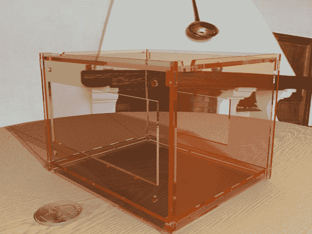

# 外壳的自动化 CAD 设计

> 原文：<https://hackaday.com/2014/11/20/automated-cad-design-for-enclosures/>

[Jon] a.k.a. [Pedantite]最近在他的业务中增加了小规模激光切割，并考虑使用激光切割机为他创建的许多项目设计增加一些价值。是的，这意味着定制激光切割外壳，但如何着手呢？[Jon]热爱自动化，这只能意味着通过从他的项目库中读取电路板文件来自动设计激光切割外壳。

塑料外壳设计自动化的想法是读取设计文件，计算出电路板的尺寸和安装孔的位置，并为激光切割机生成一个文件。选择的武器是 OpenSCAD，这是一种可以高度参数化的设计语言，可以读取外部设计文件，并为激光切割生成合适的 DXF 文件。

[Jon]将他的工具链设置为 Python 脚本，该脚本读取设计文件，将参数发送到. SCAD 文件，并为激光切割机生成 DXF。还有一个位可以为 Blender 生成足够的数据来呈现成品的 3D 图像，所有这些都只来自 gerbers、一个 drill 文件和一些用户变量。

这些文件的来源尚未公布，但这只是因为它现在处于概念验证阶段。你可以看看下面的一个例子。

