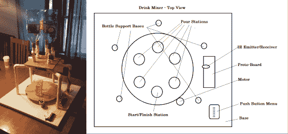

# 自动饮料搅拌机是派对的生命

> 原文：<https://hackaday.com/2013/12/22/automated-drink-mixer-is-the-life-of-the-party-2/>

举办新年晚会，但不想整晚困在吧台后面？你*可以*端出一两碗~~掺料~~潘趣酒，但诀窍在哪里？康奈尔大学的学生[Justin]和[Austin]发明了自动调酒器，让你从倒酒的工作中解脱出来。他们的设计使用了一个直径为 14 英寸的转盘，由一个 12 伏的双向电机驱动，电机连接到一个 2 英寸的橡胶轮上。电机能够达到 70 转/分，因此玻璃最终以 10 转/分的速度行驶。订单通过按钮菜单输入。由于这是一个学校项目，应该遵守 IEEE 标准，所有的酒是不含酒精的。

该软件使用一个支配性的状态机，所以系统在空闲时轮询来自菜单的输入。当它收到一个命令时，旋转玻璃到正确的喷口或一系列喷口，然后返回起点。[Justin]和[Austin]用红外发射器和光电晶体管控制玻璃的位置。这对探测器探测边缘周围间隔 60°的黑色胶带。比较器将信号数字化，并在软件中触发中断，从而计算 60 个切片的数量。一个完整的演示在跳跃后等着你。在你跳之前:负责任地喝酒，孩子们。如果你无法应对这个特殊的挑战，那就给自己做一个[酒精感知 LED 冰块](http://hackaday.com/2013/01/09/led-ice-cubes-prevent-alcohol-induced-blackouts/)。如果你的生活中需要更多的 led 灯，那就唤醒[酒鬼](http://hackaday.com/2012/08/28/inebriator-servers-up-all-the-cocktails/)。

[https://www.youtube.com/embed/NFdhPKCJYdE?version=3&rel=1&showsearch=0&showinfo=1&iv_load_policy=1&fs=1&hl=en-US&autohide=2&wmode=transparent](https://www.youtube.com/embed/NFdhPKCJYdE?version=3&rel=1&showsearch=0&showinfo=1&iv_load_policy=1&fs=1&hl=en-US&autohide=2&wmode=transparent)

[谢谢[布鲁斯](http://people.ece.cornell.edu/land/)