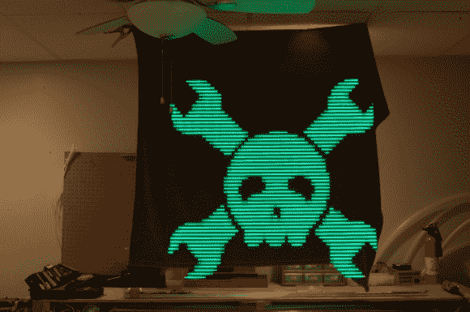

# 自动灯光绘画使它变得容易

> 原文：<https://hackaday.com/2014/03/11/automated-light-painting-makes-it-easy/>

我们能说什么呢——我们是以我们最喜欢的标志为特色的项目的吸盘。这是[视差推进器自动光绘机](http://www.embeddedaesthetics.com/projects/automated-light-painting/)——不，这是**而不是**一种视觉暂留设置。

[Daniel]、[Nathan]和 Embedded Aesthetics 的人都是 Hack a Day 的忠实粉丝，他们非常兴奋地分享他们的新项目。这是一个全自动的光画设置，具有 X 轴滑块，一条 RGB LEDs，一个[视差推进器](http://hackaday.com/2011/01/04/getting-started-with-the-parallax-propeller/)(微控制器)，和一个 DSLR——你所要做的就是选择一个图像，然后按下开始。

他们首先用他们的 [LED 画笔](http://www.embeddedaesthetics.com/projects/led-paint-brush/)开始光绘，这是一个同样棒，但自动化程度稍低的工具。他们创造了这个更具互动性的网站——事实上，你可以登录他们的网站，上传一张图片，然后[它会给你画一张图片！](http://www.embeddedaesthetics.com/interactive-light-painting/)但是……现在还没有。

[https://www.youtube.com/embed/m9yf8oYotvg?version=3&rel=1&showsearch=0&showinfo=1&iv_load_policy=1&fs=1&hl=en-US&autohide=2&wmode=transparent](https://www.youtube.com/embed/m9yf8oYotvg?version=3&rel=1&showsearch=0&showinfo=1&iv_load_policy=1&fs=1&hl=en-US&autohide=2&wmode=transparent)

需要更大的光线人像？一个能制作 4 米高图像的怎么样？而这台 delta bot 光绘机就是[太酷了。](http://hackaday.com/2013/07/03/super-precise-light-painting-from-a-delta-robot/)