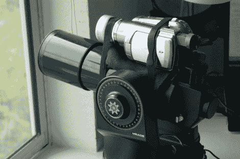

# 自动飞机跟踪；雷达系统工程师为了好玩做了什么

> 原文：<https://hackaday.com/2012/05/04/automatic-airplane-tracking-what-radar-systems-engineers-do-for-kicks/>

[G. Eric Rogers]是一名雷达系统工程师，他刚好住在当地机场的飞机进场路线的视线范围内。我们想知道这是不是找房子的标准之一？自然，他想要一个自己的跟踪飞机的家庭系统。他最终为了这个目的重新使用了一个电动望远镜。

该系统实际上并不使用雷达进行跟踪。相反，绑在望远镜上的摄像机正在给[一个视频实验者防护罩](http://hackaday.com/2011/03/24/video-experimenter-shield/)。跟踪算法分析视频并推断矢量数据。从那里，Arduino 可以通过 RS232 接口控制基本单元。

现在系统中有一些错误。Arduino 有点多动症，在跟踪过程中失去兴趣并睡着了。[Eric 的]解决方法是使用 RS232 板定期重置 Arduino，但他希望尽快解决这个问题。