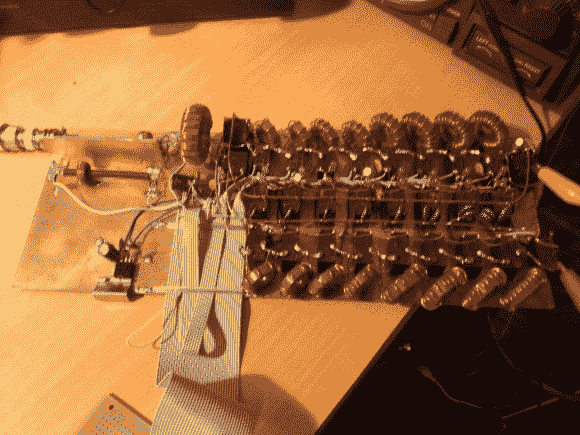

# 自动天线调谐器

> 原文：<https://hackaday.com/2014/01/06/automatic-antenna-tuner/>

为了使天线获得最佳的功率传输，需要进行调谐。这一过程使用负载来匹配传输线和天线，从而控制驻波比(SWR)。

【k3ng】自建[自动天线调谐器](http://blog.radioartisan.com/arduino-antenna-tuner/)。首先，它使用一个[串联匹配耦合器](http://www.giangrandi.ch/electronics/tandemmatch/tandemmatch.shtml)测量线路的 SWR。该设备允许提取线路上的正向和反射信号。它们被缓冲并馈入 Arduino 进行采样。使用这些数据，设备可以计算 SWR。RF 信号也经过分频和采样来测量频率。

为了自动调谐，Arduino 在电路中切换一组电容器和电感器。通过改变负载，它可以找到给定天线和频率的理想匹配。一旦完成，这些设置就存储在 EEPROM 中，以便以后调用。

休息之后，看看调谐器点击其继电器和匹配负载的视频。

[https://www.youtube.com/embed/SoVW1cxrKOE?version=3&rel=1&showsearch=0&showinfo=1&iv_load_policy=1&fs=1&hl=en-US&autohide=2&wmode=transparent](https://www.youtube.com/embed/SoVW1cxrKOE?version=3&rel=1&showsearch=0&showinfo=1&iv_load_policy=1&fs=1&hl=en-US&autohide=2&wmode=transparent)

[RichV]