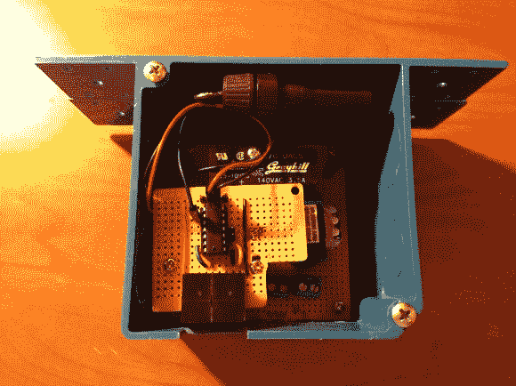

# 自动壁橱灯开关

> 原文：<https://hackaday.com/2013/03/28/automatic-closet-lightswitch/>

[Dillon]写信告诉我们他的最新项目，一个用于他家走廊壁橱~~和~~的[自动电灯开关。虽然这个项目可能非常简单，但[Dillon]以一种实际上看起来很专业的方式完成了一切，并且有一些简洁的功能。查看他的网站，获取更多的建筑图片。](http://tinkeringetc.blogspot.com/2013/03/closet-door-lightswitch.html "closet door light switch")

我们并不介意杂乱的线路，但如果是在房子里，整洁总是更好。另一方面，这个项目从想法到实施花了将近一年时间，所以请继续提交你的项目。我们理解。

作为一名电子工程专业的学生，[Dillon]在基本的电子元件上并不吝啬，他的网站上有原理图。MSP430 微控制器为一切提供“大脑”,如果门没有关上，5 分钟后灯就会关闭。请务必在休息后查看他的视频概述，其中包含实际操作的片段。

[https://www.youtube.com/embed/nNPvcqHWbkE?version=3&rel=1&showsearch=0&showinfo=1&iv_load_policy=1&fs=1&hl=en-US&autohide=2&wmode=transparent](https://www.youtube.com/embed/nNPvcqHWbkE?version=3&rel=1&showsearch=0&showinfo=1&iv_load_policy=1&fs=1&hl=en-US&autohide=2&wmode=transparent)