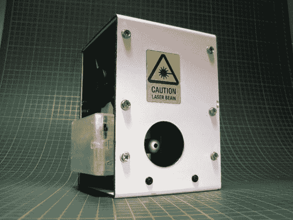

# 硬盘组件制作的自动激光水平仪？

> 原文：<https://hackaday.com/2014/06/02/automatic-laser-level-made-from-hard-drive-components/>

[crispr dy]发现他需要一个激光水平仪，但他不想花几百美元买一个可能只会用几次的工具……所以他决定自己做一个。

如果你不熟悉，激光水平仪投射激光束，水平到你放它的任何地方——它的工作原理是有一个非常精确的万向节组件，使激光垂直于重力。为了建造他的万向架，[克里斯彭德里]需要一个高度精确的轴承组件来建造他的万向架——还有什么比用硬盘更好的呢？

他使用主轴承从盘片的一个轴，轴承从读写臂的第二个轴。一个装满 MDF 的方形铝管安装在轴承上，形成一个加重的钟摆。然后用一个调节螺丝将激光指示器固定在上面进行校准。

校准是棘手的部分。他的新万向架组件保证垂直于重力，但激光指示器支架却不是。他用一根装满水的长管将他的激光笔照射在他的花园上，并调整它，直到它与他的水管水平平行。聪明！

事实上，几年前我们已经看到过类似的版本,有它自己的优点——尽管【克里斯宾德里的】更精致一些。