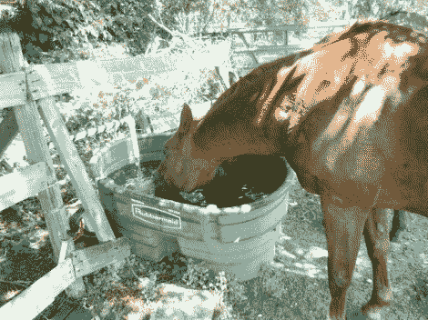

# 自动水槽灌装机确保动物有水喝

> 原文：<https://hackaday.com/2012/07/19/automatic-trough-filler-makes-sure-the-animals-have-water/>

对美国的许多地方来说，这是一个炎热的夏天。高温有时很危险，确保牲畜有他们需要的水是非常重要的。【Maddox】最近[升级了水槽](http://www.zephyr-labs.com/?p=14)的自动化，这将有助于这一过程。当然，他们仍然必须检查动物，但这将确保在这些访问之间有足够的水喝，并且故障不会浪费宝贵的水。

这里一直有一定程度的自动化，但它依赖于浮阀，而浮阀经常出现故障。这个项目试图摆脱浮阀，使用类似灌溉中使用的电磁阀。这些螺线管可以用 9V 电池供电，比机械阀更可靠。仍然有一个浮子传感器测量水位，在需要时注满水槽。

原型使用 MSP430 Launchpad，并据此设计 PCB。因为这需要防风雨，所以采购了防水外壳。制造外壳的公司还提供 DXF 模板，[Maddox]使用这些模板来确定 PCB 的尺寸和轮廓。