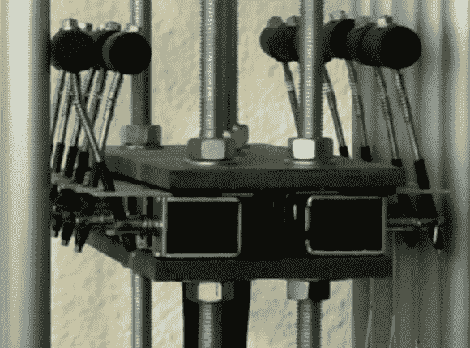

# 自动管状钟也给了一个 MIDI 接口

> 原文：<https://hackaday.com/2013/04/22/automatic-tubular-bells-given-a-midi-interface-too/>

我们不得不说…这些管状的铃铛听起来太可怕了！他们没有严格的音高中心，所以在我们听来他们真的很不合拍。但我们认为这是仪器本身的失败，而不是[托莱门]为[自动化仪器](http://www.tolaemon.com/etb/)所做的工作。

他的项目有三个主要部分。第一个，如上所示，为每个铃添加一个锤子。锤子是铰接的，一侧由螺线管拉动，以敲击钟。黑客的第二部分也使用螺线管，通过将毛毡垫压在管的底部来抑制铃声。项目的最后部分通过将 MIDI 控制添加到硬件来实现这一切。

休息后的片段很好地概述了不同的功能，包括一些预编程回放以及使用电子键盘直接控制乐器。这让我们想起了[那个刮蹭造的螺线管木琴](http://hackaday.com/2010/12/02/make-your-own-solenoids-then-play-the-xylophone)。

[https://www.youtube.com/embed/TGtl7C93Nnk?version=3&rel=1&showsearch=0&showinfo=1&iv_load_policy=1&fs=1&hl=en-US&autohide=2&wmode=transparent](https://www.youtube.com/embed/TGtl7C93Nnk?version=3&rel=1&showsearch=0&showinfo=1&iv_load_policy=1&fs=1&hl=en-US&autohide=2&wmode=transparent)

[谢谢乔迪]