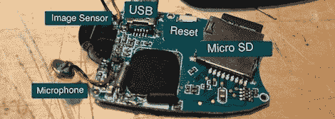

# 用摄像机投掷器自动定时

> 原文：<https://hackaday.com/2012/04/12/autonomous-time-lapse-with-a-video-camera-throwie/>

当[Matt]看到一个可以安装在钥匙链上的小型摄像机时，首先想到的是一个延时摄像机。就像我们之前看到的 LED +硬币电池+磁铁一样(并部署…)， [[Matt]的视频投掷器](http://daughtrey.com/?cat=25)将被部署在有趣的地方几天，并拍摄延时视频，直到电池耗尽。

[马特]拿起的相机具有拍摄视频或静态图片并将其写入 microSD 卡的能力。为了使他的相机胶片成为延时视频，[Matt]将一个 ATtiny45 连接到相机快门和电源按钮，并上传了一小段代码，每隔 15 秒拍摄一张照片。

现在，[马特]在他的视频投掷上遇到了一些问题。当相机打开时，它会遍历 SD 卡以找到下一个未使用的文件名。这需要几秒钟的时间，所以当前的设置会慢慢加快延时视频的速度。这不是一个不可克服的问题，所以我们期待这些[强悍的小相机](http://hackaday.com/2011/08/03/model-rocketry-from-the-rockets-point-of-view/)将拍摄的非常有趣的视频。

休息之后看看[Matt]的融冰视频。

[https://www.youtube.com/embed/dtWfPSzhBXw?version=3&rel=1&showsearch=0&showinfo=1&iv_load_policy=1&fs=1&hl=en-US&autohide=2&wmode=transparent](https://www.youtube.com/embed/dtWfPSzhBXw?version=3&rel=1&showsearch=0&showinfo=1&iv_load_policy=1&fs=1&hl=en-US&autohide=2&wmode=transparent)