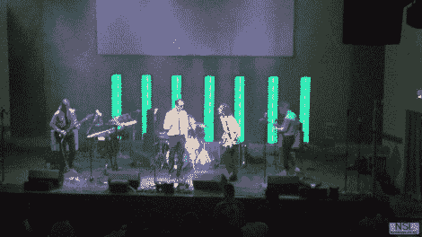

# 用一些 RGB 舞台灯来支持乐队

> 原文：<https://hackaday.com/2012/08/14/back-up-the-band-with-some-rgb-stage-lights/>

刚刚结束红牛创作大赛 72 小时的疯狂，北街实验室的一些人接手了一个舞台灯光项目。这是一个刚刚开放的当地表演场地，尽管时间紧迫，该团队还是完成了另一个伟大的建筑。

16 米长的 LED 灯带使该项目的电子设备变得更加简单。这些条带沿着橱柜的中心向上延伸，橱柜是作为独立的柱子建造的，最终将位于舞台的后部。每个机柜都有自己的 5V 4A 电源(注意他们提到的使用廉价易贝 PSU 时的烧毁问题)。每根柱子都有自己的 Arduino Uno 来驱动 led，并用 RS485 屏蔽连接回主 Arduino Mega 2560 控制器。它使用 PSX 控制器在不同的照明模式之间切换。

拥有 688 个发光二极管的七塔并不是这场秀的全部亮点。还有大约 300 英尺长的电线在工作。

[https://www.youtube.com/embed/r1jY6seW0_4?version=3&rel=1&showsearch=0&showinfo=1&iv_load_policy=1&fs=1&hl=en-US&autohide=2&wmode=transparent](https://www.youtube.com/embed/r1jY6seW0_4?version=3&rel=1&showsearch=0&showinfo=1&iv_load_policy=1&fs=1&hl=en-US&autohide=2&wmode=transparent)