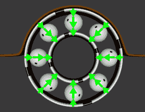
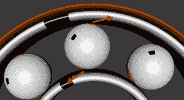

# 滚珠轴承电机滚动，原因不明

> 原文：<https://hackaday.com/2014/01/29/ball-bearing-motor-rolls-for-reasons-unknown/>

[RimstarOrg]本周为我们带来了一首老歌。他制造了一个滚珠轴承马达，这个设计几十年来一直引起工程师和科学家的争论。[RimstarOrg]使用一个带有 70 匝初级线圈和单匝次级线圈的微波炉变压器来制造低压、大电流交流电源。不用说，像这样的设置确实有火灾或触电的风险，所以如果你在家里尝试这种设置，一定要小心。[RimstarOrg]然后自己制造马达。[他去除了两个滚珠轴承](http://www.youtube.com/watch?v=fdvRFE680u0)的油脂，然后将它们和一个木制飞轮一起安装在一个金属轴上。然后将整个组件安装在一块板上，这样轮子就可以自由旋转。两条铜带将轴承固定在电路板上。最后，将变压器连接到铜带中。在这种配置中，电流将流经一个轴承的外圈，通过滚珠，然后流入内圈。然后，电流沿着轮轴向下传递，并通过另一个轴承。这个电路的电阻很小，所以每次只能通电几秒钟，然后东西就开始融化了。

当飞轮静止时接通电流，没有任何反应。如果放置的时间足够长，轴承会过热。如果你在接通电流之前让飞轮旋转一下，真正的魔法就开始了。一旦通电，飞轮开始加速。断电，事情开始变慢。飞轮顺时针和逆时针旋转都会发生这种情况。

这是怎么回事？没有磁铁的马达？这是某种永动机吗？外星科技？我们可以向你保证这种效果是真实的，但其机制仍未被证实。[RimstarOrg]解释了一个常见的解释，即马达作为[热机](http://en.wikipedia.org/wiki/Heat_engine)运行，而不是标准的电动马达。金属滚珠轴承与各自的滚道接触点相对较小。这些小点产生一个大电阻，导致球加热不均匀。受热的球膨胀成椭圆形。如果整个滚珠轴承不转动，膨胀力会将两个座圈锁在一起。如果在膨胀开始时马达在转动，它就会推动外圈向前运动。

不过这并不是对马达的唯一解释。多年来，人们已经提出了几种对马达运动的电磁解释。这些解释背后的物理学相当复杂。复杂的数学和积分可以在[h . gruen Berg]1977 年的论文中找到。最近的一个例子是普林斯顿大学的 Kirk T. McDonald 教授在 [2011 年发表的论文(2013 年 7 月更新)](http://www.physics.princeton.edu/~mcdonald/examples/motor.pdf) (pdf 链接)。

[RimstarOrg]并不是唯一一个解决这个问题的爱好者-[ Mike]也有一个关于滚珠轴承电机的页面。他得出了热解释的结论。甚至[维基似乎对这个话题有点困惑](http://en.wikipedia.org/wiki/Ball_bearing_motor)。每个人都同意的唯一一件事是，滚珠轴承电机效率太低，没有任何实际用途。我们可能有点天真，但似乎一些简单的动手实验可以解决这个几十年的老问题。一个基本的测试将是尝试 DC 与交流电流-也许用一个普通的汽车电池作为电源。深入研究，有色金属与含铁球。真正的答案在于使用已知热膨胀特性的滚珠轴承。膨胀更多(且速率更高)的球应该比“控制”球产生更快的运转马达。打个电话给[当地的轴承供应商](http://www.bocabearings.com/)来彻底解决这个问题可能是值得的。

[https://www.youtube.com/embed/DjKhggNJGls?version=3&rel=1&showsearch=0&showinfo=1&iv_load_policy=1&fs=1&hl=en-US&autohide=2&wmode=transparent](https://www.youtube.com/embed/DjKhggNJGls?version=3&rel=1&showsearch=0&showinfo=1&iv_load_policy=1&fs=1&hl=en-US&autohide=2&wmode=transparent)

[via [被黑的小工具](http://hackedgadgets.com/2014/01/27/ball-bearing-motor-how-does-it-work/)