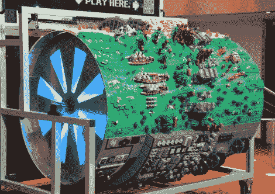

# 乐高制成的管风琴演奏星球大战主题

> 原文：<https://hackaday.com/2012/04/15/barrel-organ-made-from-lego-plays-the-star-wars-theme/>

无论你是否是《星球大战》前传第一部的粉丝，你都必须看看[洛伦兹]和[蕾妮·霍夫迈斯特]为这部电影的 3D 首映做了些什么。

为了以新的方式捕捉《星球大战》的精髓，他们用乐高积木建造了一个大型管风琴，当转动时，它会播放电影传奇的开场主题。枪管分为四个部分，每个部分都以塑料块的形式代表了该系列的一个标志性设置。

霍斯、死星、塔图因和恩多都出现在风琴上，每个环境的建筑都演奏这首歌的特定音符。当桶转动时，每个乐高结构通过一个由金属臂和乐高轮胎制成的“阅读”机制，在连接的风琴上触发一个音符。

它看起来很棒，听起来也很不错。一定要留下来看一段展示管风琴演奏的短片。

[通过[连线](http://www.wired.com/underwire/2012/04/lego-star-wars-barrel-organ)

[https://www.youtube.com/embed/g5Lgcen-PGI?version=3&rel=1&showsearch=0&showinfo=1&iv_load_policy=1&fs=1&hl=en-US&autohide=2&wmode=transparent](https://www.youtube.com/embed/g5Lgcen-PGI?version=3&rel=1&showsearch=0&showinfo=1&iv_load_policy=1&fs=1&hl=en-US&autohide=2&wmode=transparent)