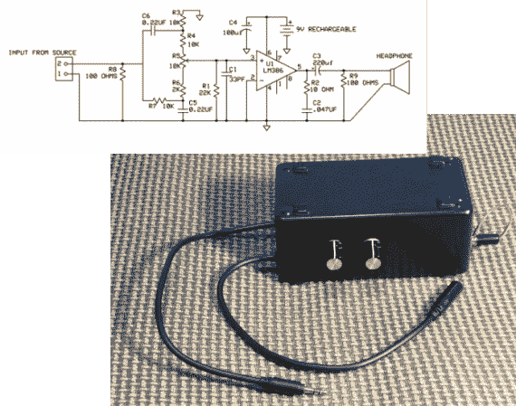

# 低音增强耳机放大器

> 原文：<https://hackaday.com/2013/11/04/bass-bump-headphone-amp/>

耳机放大器有助于简单、实用的电子项目。 [Bass Bump 耳机放大器](http://makezine.com/projects/bass-bump-headphone-amp/ "Bass Bump Headphone Amp")也不例外，因为它是由易于采购的部件制成的，并且可以构建在原型板上。

我们已经见过经典 cMoy 放大器的许多变体，包括[这个漂亮的](http://hackaday.com/2012/04/13/free-formed-circuit-protected-by-a-brick-of-crystal-clear-resin/ "Free formed circuit protected by a brick of crystal clear resin")。低音增强的不同之处在于提供了对低音频率的控制。它通过在放大器前放置一个滤波器来实现，用一个电位计来选择混合频率。这进入一个 LM386 音频放大器。在输出端是一个 [Zobel 网络](http://en.wikipedia.org/wiki/Zobel_network)，用于在高频时保持低阻抗。该放大器可以由 9V 充电电池或 USB 端口供电。

这是一个简单的构建，但绝对是一个很好的雨天尝试。这篇文章解释了模拟电路的工作原理，并给出了如何构建的完整说明。休息之后，请观看该项目的视频概述。

[https://www.youtube.com/embed/fBrhD9IflU4?version=3&rel=1&showsearch=0&showinfo=1&iv_load_policy=1&fs=1&hl=en-US&autohide=2&wmode=transparent](https://www.youtube.com/embed/fBrhD9IflU4?version=3&rel=1&showsearch=0&showinfo=1&iv_load_policy=1&fs=1&hl=en-US&autohide=2&wmode=transparent)