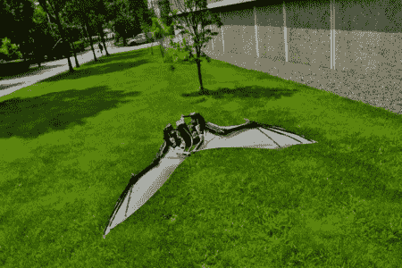

# 蝙蝠机器人:建造一个功能正确的蝙蝠翼机器人

> 原文：<https://hackaday.com/2012/06/10/batbot-building-a-functionally-correct-bat-wing-robot/>

蝙蝠机器人是一个项目，其中研究人员试图模仿蝙蝠翅膀的生物结构进行飞行。由于翅膀形状的不断变化，人们希望获得蝙蝠飞行时的机动性和敏捷性。还有，蝙蝠看起来真的很酷。在试图模仿这种结构时，他们决定使用基于 SMA 的人工肌肉和钢腱，而不是你在大多数扑翼机中看到的典型凸轮连杆。

不幸的是，没有这个机器人试图飞行的视频。这个项目有一个演示视频(如下),详细解释了他们在做什么，以及他们是如何做的。它也有一些真正的蝙蝠做他们所做的事情的非常酷的慢动作镜头。

[途径 [Adafruit](http://www.adafruit.com/blog/2012/06/08/batbot-a-biologically-inspired-morphing-wing-bat-robot/)

[https://www.youtube.com/embed/fY4f3XXNliM?version=3&rel=1&showsearch=0&showinfo=1&iv_load_policy=1&fs=1&hl=en-US&autohide=2&wmode=transparent](https://www.youtube.com/embed/fY4f3XXNliM?version=3&rel=1&showsearch=0&showinfo=1&iv_load_policy=1&fs=1&hl=en-US&autohide=2&wmode=transparent)