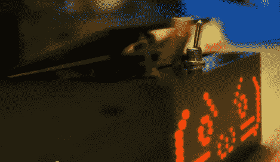

# 战斗最无用的机器得到一个富有表现力的升级

> 原文：<https://hackaday.com/2012/10/22/battling-most-useless-machine-gets-an-expressive-upgrade/>

我们认为唯一比最没用的机器更没用的事情就是给它一张表情脸。但这正是这个项目所发生的事情。但是你会想看到整个过程，因为这个演示不仅仅是一个可以自动关闭的愤怒的盒子。

这是愤怒盒子的第二次迭代。正如我们在大约 18 个月前看到的，它最终会受够了你打开开关，让自己在桌子上跑来跑去。这个版本开始时，红色 LED 矩阵上画了一个相当令人愉快的脸，占据了外壳的正面。在第一次被激活后，它会漫不经心地将开关拨到关闭位置。但是如果你坚持把它打开，事情会变得很快。休息后的视频中显示了这一点。但是如果你能通过可怕的机器翻译，在这个帖子中会有[一些构建细节。](http://translate.google.com/translate?hl=en&sl=ja&tl=en&u=http%3A%2F%2Fblogs.yahoo.co.jp%2Fd061333%2Ffolder%2F1045605.html)

[https://www.youtube.com/embed/bOD2-mRphTI?version=3&rel=1&showsearch=0&showinfo=1&iv_load_policy=1&fs=1&hl=en-US&autohide=2&wmode=transparent](https://www.youtube.com/embed/bOD2-mRphTI?version=3&rel=1&showsearch=0&showinfo=1&iv_load_policy=1&fs=1&hl=en-US&autohide=2&wmode=transparent)

【via [琐碎的工程](http://frivolousengineering.com/?p=4077)