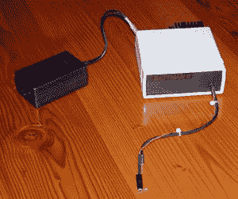

# BattMan II:你的电池应得的充电器

> 原文：<https://hackaday.com/2012/06/17/battman-ii-the-charger-your-batteries-deserve/>

当你的无线电控制设备电池耗尽时，你没有比[呼叫 BattMan II](http://www.stefanv.com/electronics/battman2.html) 更好的选择了。这款设备包含了各种电池的循环和充电功能。它是通过你的并行端口由计算机控制的(是的，还记得那些吗？)和配套软件，让你各种控制和数据。

文章相当广泛，包括原理图，所以你可以建立自己的。也有一步一步的分解每个部分的功能，以及每种不同的充电方法的解释。干得好[斯特凡]

如果你只是想在冗长的特性列表中找到一个顶点，请继续阅读。

硬件特性列表:

*   适用于 1.2 至 14.7 伏的镍镉(NiCd)、镍氢(NiMH)、锂离子(Li-Ion)、锂聚合物(LiPo)、纳米磷酸锂(LiNP)和铅酸(Pb-Acid)电池。†
*   以 130 毫安的速度向 2A 放电，测量电池容量。
*   以 130mA 至 1.3A 的速率充电
*   自动执行重复的放电/充电循环，以适应新电池，或消除旧电池的 NiCd 电压下降。
*   测量内部电阻。
*   监控自放电。
*   实时图形显示让您看到诸如细胞不匹配等问题。
*   记录所有执行的操作，可以导入到任何电子表格程序中。
*   保存充电、放电、自动循环和监控操作的图表。
*   通过并行端口连接到任何运行 Microsoft Windows (95、98、ME、2000、XP、Vista 或 Windows 7)的 PC。††
*   带有完整源代码的操作软件可从[下载](http://www.stefanv.com/rcstuff/battman2/InstallBattMan2.exe)。